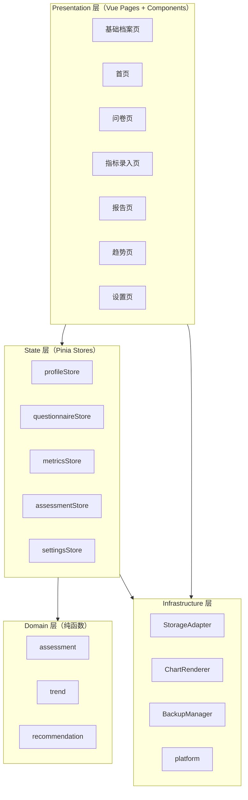
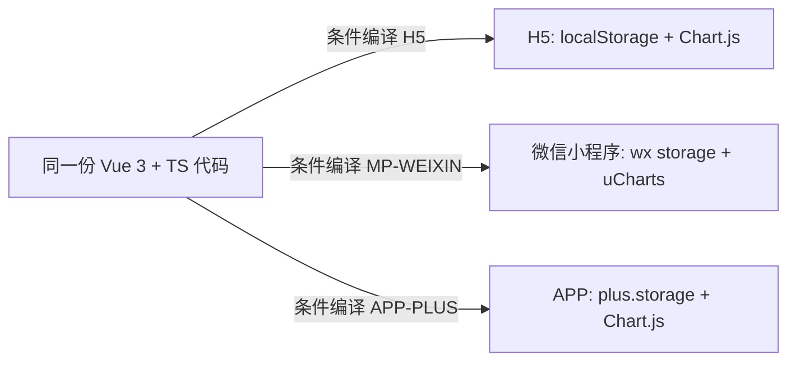
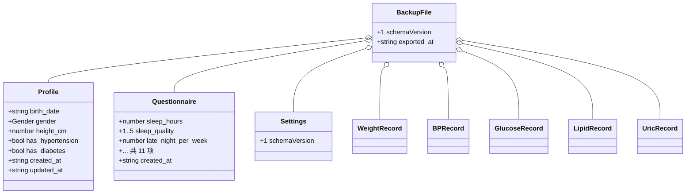
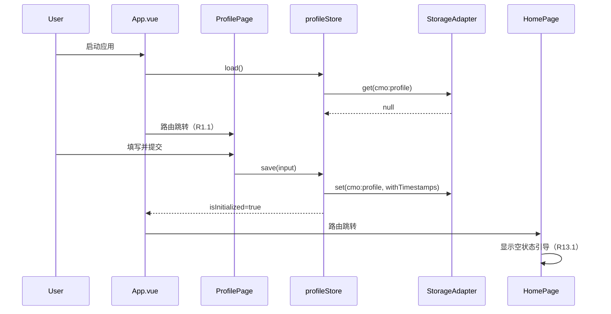
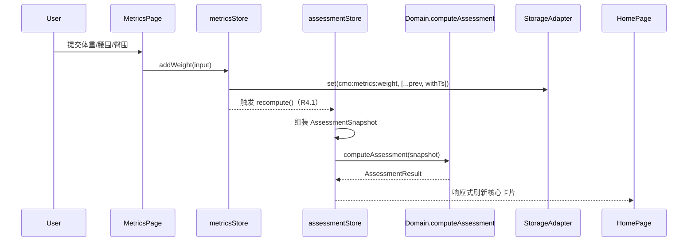
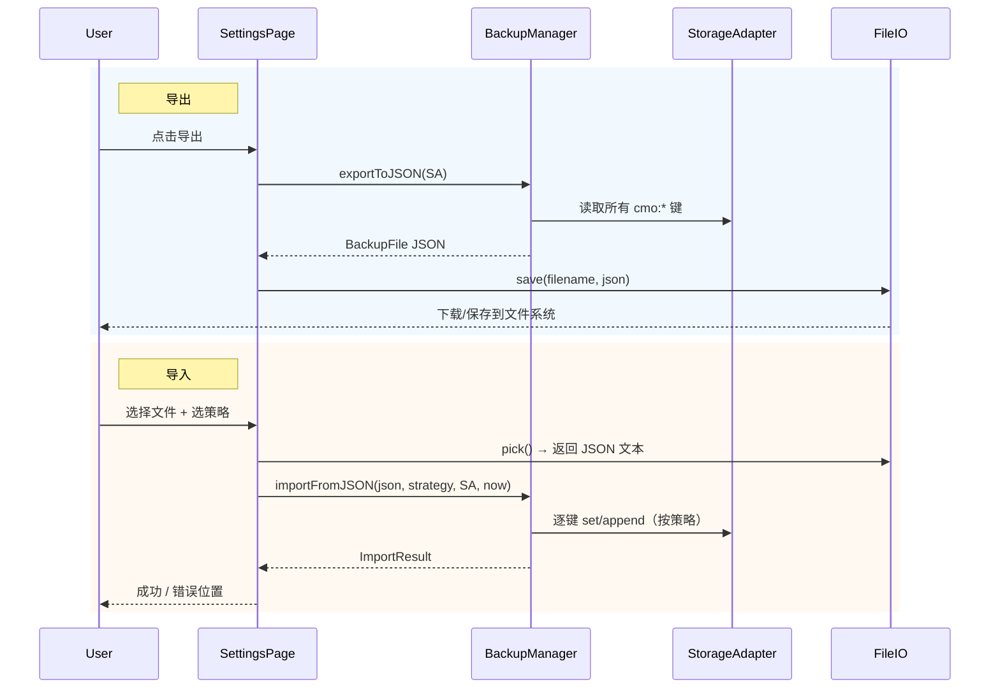

# Design Document — 首席代谢官（Chief Metabolic Officer, CMO）

## Overview

首席代谢官是一个面向个人用户的代谢健康自评估应用，遵循以下设计原则：

- **打开即用**：无注册、无登录、无服务器同步（R18.4, R18.5）
- **三端一体**：H5 / 微信小程序 / APP 共享同一份 Vue 代码
- **纯本地**：所有数据通过 uni-app 统一存储 API 落地于本机
- **纯函数评估引擎**：Domain 层不依赖任何运行时 API，可直接被属性测试覆盖
- **可演进**：Phase 1 走手动导入导出 JSON 实现"多端同步"；Phase 2 可在不改 Domain 层的前提下加入云同步

产品名：**首席代谢官**（CMO）。范围严格遵循 requirements.md 第 11 节 MVP 定义。

---

## Architecture

### 2.1 总体架构



### 2.2 关键架构约束

| 约束 | 说明 | 目的 |
|---|---|---|
| Domain 层零运行时依赖 | 不可 import uni、不可调用 Date.now、不可读 storage | 可被纯单元测试 + Property-Based Testing 覆盖（R4.6, R8.5, R10.6） |
| 评估输入为快照 | `computeAssessment(snapshot)`，所有数据由调用方组装好 | 确定性输出（同输入恒同输出） |
| Storage 通过适配器 | 所有 uni 存储调用集中在 StorageAdapter | 三端切换时只改一个文件，便于 mock |
| 图表通过条件编译 | H5/APP 用 Chart.js，小程序用 uCharts | 平台原生特性最大化（R12） |
| 单向数据流 | UI → Store → Domain → Store → UI；Infra 仅被 Store 调用 | 心智简单、状态可追踪 |

### 2.3 三端运行时



---

## Project Structure

```
src/
  main.ts
  App.vue
  pages.json                      # uni-app 路由注册
  manifest.json                   # uni-app 应用配置
  pages/
    profile/
      ProfilePage.vue             # 基础档案录入与编辑（R1）
    home/
      HomePage.vue                # 代谢总览（R13）
    questionnaire/
      QuestionnairePage.vue       # 生活方式问卷（R2）
    metrics/
      MetricsPage.vue             # 5 个 Tab 的指标录入（R3）
    report/
      ReportPage.vue              # 代谢评估报告（R4–R10）
    trend/
      TrendPage.vue               # 趋势页（R11）
    settings/
      SettingsPage.vue            # 导出/导入/清空/关于（R14–R17）
  components/
    chart/
      ChartView.vue               # 跨端图表统一组件（R12）
      adapters/
        chart-h5.ts               # Chart.js 适配
        chart-mp.ts               # uCharts 适配
    common/
      MetricCard.vue
      ConfirmDialog.vue
      EmptyState.vue
  stores/
    profile.ts                    # profileStore
    questionnaire.ts              # questionnaireStore
    metrics.ts                    # metricsStore
    assessment.ts                 # assessmentStore（派生态）
    settings.ts                   # settingsStore
  domain/
    assessment/
      types.ts                    # AssessmentSnapshot / AssessmentResult / Deduction
      bmi.ts                      # computeBMI / classifyBMI（R6）
      whr.ts                      # computeWHR / classifyWHR（R6）
      uric.ts                     # classifyUric（R7）
      metabolicSyndrome.ts        # evaluateMetS（R5）
      missingData.ts              # buildSnapshot / coverageScore（R9）
      score.ts                    # computeScore（R4）
      metabolicAge.ts             # computeMetabolicAge（R8）
      index.ts                    # computeAssessment（顶层组合）
    trend/
      regression.ts               # linearRegressionSlope（R11.2）
      thresholds.ts               # 体重/血糖/评分/腰围阈值（R11.3-6）
      classify.ts                 # classifyTrend（R11.7）
    recommendation/
      catalog.ts                  # 通用建议词条
      rules.ts                    # generateRecommendations（R10）
  infra/
    storage/
      keys.ts                     # 存储键名常量（R18.2）
      schema.ts                   # 类型 + schemaVersion = 1（R19.5）
      StorageAdapter.ts           # 封装 uni.* 存储 API（R18.1）
      migrations.ts               # 预留 schema 升级
    backup/
      exporter.ts                 # exportToJSON（R14）
      importer.ts                 # importFromJSON（R15）
      file-h5.ts                  # H5 下载/选择
      file-mp.ts                  # 小程序保存/选择
      file-app.ts                 # APP plus.io
    platform/
      detect.ts                   # 运行平台检测
  utils/
    date.ts                       # ISO 8601 工具、age 计算
    id.ts                         # 备份/记录 ID
    validators.ts                 # 字段范围校验（与 requirements 一致）
  styles/
    variables.scss
    base.scss

tests/
  domain/
    score.spec.ts
    score.property.spec.ts        # fast-check
    metabolicSyndrome.spec.ts
    metabolicAge.spec.ts
    bmi.spec.ts
    whr.spec.ts
    trend.spec.ts
    recommendation.spec.ts
  infra/
    backup.spec.ts                # 含幂等性测试（R15.6）
    storage.spec.ts               # mock uni
```

---

## Components and Interfaces

### 数据模型（`infra/storage/schema.ts`）

```ts
export const SCHEMA_VERSION = 1 as const;

export type Gender = 'male' | 'female';

export interface Profile {
  birth_date: string;          // ISO date 'YYYY-MM-DD'
  gender: Gender;
  height_cm: number;           // (R1.3) [50, 250]
  has_hypertension: boolean;
  has_diabetes: boolean;
  created_at: string;
  updated_at: string;
}

export interface Questionnaire {
  sleep_hours: number;                // [0, 24]
  sleep_quality: 1 | 2 | 3 | 4 | 5;
  late_night_per_week: number;        // [0, 7]
  sugary_drink_per_week: number;      // [0, 50]
  midnight_snack_per_week: number;    // [0, 7]
  takeout_per_week: number;           // [0, 21]
  exercise_per_week: number;          // [0, 21]
  sedentary_hours_per_day: number;    // [0, 24]
  alcohol_per_week: number;           // [0, 21]
  smoking: boolean;
  stress_level: 1 | 2 | 3 | 4 | 5;
  created_at: string;
}

export interface BaseRecord { created_at: string; updated_at: string; }

export interface WeightRecord extends BaseRecord {
  weight_kg?: number;          // [20, 300]
  waist_cm?: number;           // [30, 200]
  hip_cm?: number;             // [30, 200]
}

export interface BPRecord extends BaseRecord {
  systolic_mmHg: number;       // [60, 260]
  diastolic_mmHg: number;      // [30, 200]
}

export interface GlucoseRecord extends BaseRecord {
  fpg_mmol_per_l?: number;     // [1, 30]
  pp2h_mmol_per_l?: number;    // [1, 40]
  hba1c_pct?: number;          // [2, 20]
}

export interface LipidRecord extends BaseRecord {
  tg_mmol_per_l?: number;      // [0.1, 30]
  hdl_mmol_per_l?: number;     // [0.1, 10]
  ldl_mmol_per_l?: number;     // [0.1, 15]
  tc_mmol_per_l?: number;      // [1, 30]
}

export interface UricRecord extends BaseRecord {
  uric_umol_per_l: number;     // [50, 1500]
}

export interface Settings {
  schemaVersion: typeof SCHEMA_VERSION;
  import_strategy_default: 'merge' | 'overwrite';
}

export interface MetricsBundle {
  weight: WeightRecord[];
  bp: BPRecord[];
  glucose: GlucoseRecord[];
  lipid: LipidRecord[];
  uric: UricRecord[];
}

export interface BackupFile {
  schemaVersion: typeof SCHEMA_VERSION;
  exported_at: string;
  profile: Profile | null;
  questionnaire: Questionnaire | null;
  questionnaire_history: Questionnaire[];
  metrics: MetricsBundle;
  settings: Settings;
}
```

### Storage Adapter（`infra/storage/StorageAdapter.ts`）

```ts
export const KEYS = {
  PROFILE: 'cmo:profile',
  QUESTIONNAIRE: 'cmo:questionnaire',
  QUESTIONNAIRE_HISTORY: 'cmo:questionnaire:history',
  METRICS_WEIGHT: 'cmo:metrics:weight',
  METRICS_BP: 'cmo:metrics:bp',
  METRICS_GLUCOSE: 'cmo:metrics:glucose',
  METRICS_LIPID: 'cmo:metrics:lipid',
  METRICS_URIC: 'cmo:metrics:uric',
  SETTINGS: 'cmo:settings',
} as const;

export const KEY_PREFIX = 'cmo:';

export interface StorageAdapter {
  get<T>(key: string): T | null;
  set<T>(key: string, value: T): void;
  remove(key: string): void;
  clearAllByPrefix(prefix: string): void;
  listKeys(): string[];
}

// 实现使用 uni.getStorageSync / uni.setStorageSync / uni.removeStorageSync
// 序列化为 JSON 字符串后存储，读取时解析；解析失败返回 null。
```

### Domain 层 — 评估引擎（`domain/assessment/`）

#### 类型（`types.ts`）

```ts
export type DeductionModule =
  | 'mets'        // 代谢综合征 5 项（R4.2）
  | 'bmi_whr'     // BMI / WHR
  | 'uric'
  | 'lifestyle';

export interface ScoreDeduction {
  module: DeductionModule;
  factor: string;        // 例如 'waist' | 'tg' | 'sleep_late_night'
  points: number;        // 实际扣分
  reason: string;        // 用于 UI 展示
}

export interface MetSItem {
  key: 'central_obesity' | 'hypertension' | 'hyperglycemia' | 'high_tg' | 'low_hdl';
  matched: boolean;
  source: 'measurement' | 'diagnosed' | 'unknown';
}

export interface AssessmentSnapshot {
  // 基础档案
  birth_date: string;
  gender: Gender;
  height_cm: number;
  has_hypertension: boolean;
  has_diabetes: boolean;
  // 评估时间（由调用方注入，保证纯函数）
  now: string;
  // 最近一次记录 + created_at（每项可缺失）
  latest: {
    weight?: { weight_kg?: number; waist_cm?: number; hip_cm?: number; created_at: string };
    bp?: { systolic_mmHg: number; diastolic_mmHg: number; created_at: string };
    glucose?: { fpg_mmol_per_l?: number; pp2h_mmol_per_l?: number; created_at: string };
    lipid?: { tg_mmol_per_l?: number; hdl_mmol_per_l?: number; created_at: string };
    uric?: { uric_umol_per_l: number; created_at: string };
  };
  questionnaire: Questionnaire | null;
}

export type ScoreMode = 'full' | 'reference' | 'unavailable';

export interface AssessmentResult {
  score: number | null;
  scoreLevel: '优' | '良' | '中' | '差' | null;
  riskLevel: '低' | '中' | '高' | null;
  metabolicAge: number | null;
  realAge: number;
  bmi: { value: number; level: 'normal' | 'overweight' | 'obese' } | null;
  whr: { value: number; level: 'normal' | 'abnormal' } | null;
  uric: { level: 'normal' | 'abnormal'; value?: number } | null;
  metsResult: { matched: number; items: MetSItem[]; diagnosed: boolean };
  deductions: ScoreDeduction[];
  mode: ScoreMode;
  confidence: number;             // [0, 1]
  coveredCount: number;           // 已采集必要指标数
  totalRequired: number;          // 6
  staleFlags: Record<string, boolean>;  // 各指标是否 ≥91 天（R20.3）
  usedTimestamps: Record<string, string | null>;  // 各项使用的 created_at（R20.2）
}
```

#### 纯函数签名

```ts
// bmi.ts
export function computeBMI(weight_kg: number, height_cm: number): number;
export function classifyBMI(bmi: number): 'normal' | 'overweight' | 'obese';

// whr.ts
export function computeWHR(waist_cm: number, hip_cm: number): number;
export function classifyWHR(whr: number, gender: Gender): 'normal' | 'abnormal';

// uric.ts
export function classifyUric(uric_umol: number, gender: Gender): 'normal' | 'abnormal';

// metabolicSyndrome.ts
export function evaluateMetS(s: AssessmentSnapshot): {
  matched: number;
  items: MetSItem[];
  diagnosed: boolean;
};

// missingData.ts
// 返回必要指标覆盖情况，不抛错（R9.6）
export function evaluateCoverage(s: AssessmentSnapshot): {
  mode: ScoreMode;
  confidence: number;
  coveredCount: number;
  totalRequired: 6;
  missingItems: Array<'weight'|'waist'|'bp'|'fpg'|'hdl'|'tg'>;
};

// score.ts
// 评分扣分制；缺失指标对应模块不扣分（R9.4）；保证 ∈ [0, 100]（R4.3）
export function computeScore(s: AssessmentSnapshot): {
  score: number;
  deductions: ScoreDeduction[];
};

// metabolicAge.ts
// metabolicAge = clamp(round(realAge + (100-score)*0.3) ± 性别微调, 0, realAge+15) (R8)
export function computeMetabolicAge(realAge: number, score: number, gender: Gender): number;

// index.ts
export function computeAssessment(s: AssessmentSnapshot): AssessmentResult;
```

#### 评分算法（落地公式）

各模块扣分细则（与 R4.2 完全对齐）：

| 模块 | 因子 | 触发条件 | 扣分 |
|---|---|---|---|
| mets | waist | 中心型肥胖（R5.2） | 12 |
| mets | bp | 高血压（R5.3，含已确诊） | 12 |
| mets | glucose | 高血糖（R5.4，含已确诊） | 12 |
| mets | tg | TG ≥ 1.7 | 12 |
| mets | hdl | HDL < 1.04 | 12 |
| bmi_whr | bmi | BMI ≥ 24（≥28 时仍扣 6） | 6 |
| bmi_whr | whr | WHR 异常 | 6 |
| uric | uric | 尿酸异常 | 8 |
| lifestyle | late_night | 熬夜 ≥3 次/周 | 3，≥5 次/周 4 |
| lifestyle | takeout | 外卖 ≥7 次/周 | 3 |
| lifestyle | sugary_drink | ≥7 次/周 | 3 |
| lifestyle | sedentary | ≥8 小时/天 | 3 |
| lifestyle | exercise | <2 次/周 | 3 |
| lifestyle | alcohol | ≥4 次/周 | 2 |
| lifestyle | smoking | 是 | 4 |
| lifestyle | stress | level ≥4 | 2 |

模块上限：mets 60、bmi_whr 12、uric 8、lifestyle 20。最终 `score = max(0, 100 - Σ模块扣分)`。

#### 评估顶层组合

```ts
function computeAssessment(s: AssessmentSnapshot): AssessmentResult {
  const realAge = ageFromBirth(s.birth_date, s.now);
  const coverage = evaluateCoverage(s);
  if (coverage.mode === 'unavailable') {
    return assembleEmpty(realAge, evaluateMetS(s));
  }
  const { score, deductions } = computeScore(s);
  const metabolicAge = computeMetabolicAge(realAge, score, s.gender);
  const bmi = s.latest.weight?.weight_kg
    ? { value: computeBMI(s.latest.weight.weight_kg, s.height_cm),
        level: classifyBMI(computeBMI(s.latest.weight.weight_kg, s.height_cm)) }
    : null;
  // ... whr / uric / metsResult / staleFlags / usedTimestamps
  return { score, scoreLevel, riskLevel, metabolicAge, ... };
}
```

### Domain 层 — 趋势分析（`domain/trend/`）

```ts
// regression.ts
// 数据点 < 3 时返回 null（R11.1）；xi 为距首条记录的天数（R11.2）
export function linearRegressionSlope(points: Array<{ x: number; y: number }>): number | null;

// thresholds.ts
export const TREND_STABLE_THRESHOLD = {
  weight: 0.05,      // kg/天 (R11.3)
  glucose: 0.02,     // mmol/L/天 (R11.4)
  score: 0.2,        // 分/天 (R11.5)
  waist: 0.05,       // cm/天 (R11.6)
} as const;

// classify.ts
export type TrendKind = 'rising' | 'falling' | 'stable' | 'insufficient_data';
export function classifyTrend(metric: keyof typeof TREND_STABLE_THRESHOLD, slope: number | null): TrendKind;

// 时间窗筛选（R11.8）
export function filterByWindow<T extends { created_at: string }>(items: T[], days: 7|30|90, now: string): T[];
```

### Domain 层 — 行动建议（`domain/recommendation/`）

```ts
export type RecCategory = 'diet' | 'exercise' | 'lifestyle';

export interface Recommendation {
  category: RecCategory;
  text: string;
  source: 'risk_factor' | 'general';
  factor?: string;
}

// 强制三类各 1 条；某类无风险因子时用 catalog 中的通用建议补齐（R10.3-5）
// 全零风险时输出三条通用建议（R10.5）
export function generateRecommendations(
  riskFactors: ScoreDeduction[],
): [Recommendation, Recommendation, Recommendation];
```

风险因子 → 类别映射（在 `rules.ts` 内固定）：

| 因子 | 类别 |
|---|---|
| waist / hdl / tg / glucose / sugary_drink / takeout | diet |
| sedentary / exercise / bmi / whr | exercise |
| late_night / smoking / alcohol / stress / bp / uric | lifestyle |

### Backup Manager（`infra/backup/`）

```ts
// exporter.ts
export function exportToJSON(read: StorageAdapter): BackupFile;

// importer.ts
export type ImportStrategy = 'merge' | 'overwrite';
export interface ImportResult {
  ok: boolean;
  errors?: string[];
  applied?: { profile: boolean; questionnaire: boolean; metricsCount: Record<string, number> };
}

// 合并算法：键为 created_at；相同时间戳新覆盖旧（R15.4），不同时间戳全部保留（R15.5）。
// 保证幂等：同一文件连续导入两次 = 一次（R15.6）。
export function importFromJSON(
  file: unknown,
  strategy: ImportStrategy,
  storage: StorageAdapter,
  now: () => string,
): ImportResult;
```

校验流程：
1. JSON.parse 失败 → 返回 `ok=false` 并携带错误位置（R15.8）
2. `schemaVersion` 不在受支持列表内 → 拒绝（R15.2）
3. 必填字段（schemaVersion / metrics 容器）缺失 → 拒绝
4. 单条记录字段越界 → 跳过该条但不中断整体导入，errors 中记录

### Chart Renderer（`components/chart/`）

```vue
<!-- ChartView.vue：通过条件编译选择实现 -->
<template>
  <view class="chart">
    <!-- #ifdef H5 || APP-PLUS -->
    <canvas ref="canvas" :style="{ height: height + 'px' }" />
    <!-- #endif -->
    <!-- #ifdef MP-WEIXIN -->
    <qiun-data-charts type="line" :chartData="chartData" :opts="opts" :canvas2d="true" />
    <!-- #endif -->
  </view>
</template>
```

```ts
// 统一 props
interface ChartViewProps {
  type: 'line';
  data: { labels: string[]; values: number[] };
  height?: number;          // 默认 220
  yAxisLabel?: string;
  unit?: string;
}
```

H5/APP 实现使用 Chart.js（npm 包），小程序使用 uCharts（本地引入，避免远程加载）。组件内屏蔽差异，业务侧只调一个接口（R12.1）。

### Pinia Stores（`stores/`）

```ts
// profile.ts
export const useProfileStore = defineStore('profile', {
  state: () => ({ profile: null as Profile | null }),
  getters: {
    isInitialized: (s) => s.profile !== null,
    realAge: (s) => s.profile ? ageFromBirth(s.profile.birth_date, nowIso()) : null,
  },
  actions: {
    load(): void;
    save(input: Omit<Profile, 'created_at'|'updated_at'>): void;
  },
});

// metrics.ts
export const useMetricsStore = defineStore('metrics', {
  state: () => ({
    weight: [] as WeightRecord[],
    bp: [] as BPRecord[],
    glucose: [] as GlucoseRecord[],
    lipid: [] as LipidRecord[],
    uric: [] as UricRecord[],
  }),
  getters: {
    latestSnapshot(): AssessmentSnapshot['latest'];
  },
  actions: {
    addWeight(rec: Omit<WeightRecord, 'created_at'|'updated_at'>): void;
    // ... 其它 add*；保证 created_at/updated_at 由 store 注入（R19.2）
  },
});

// assessment.ts —— 派生 store，订阅上面三个变化后调用 computeAssessment
export const useAssessmentStore = defineStore('assessment', {
  state: () => ({ result: null as AssessmentResult | null }),
  actions: {
    recompute(): void;        // R4.1 触发点
  },
});
```

### 平台层（`infra/platform/`）

```ts
export type Platform = 'h5' | 'mp-weixin' | 'app-plus' | 'unknown';
export function getPlatform(): Platform;

// 文件 IO 抽象
export interface FileIO {
  save(filename: string, content: string): Promise<{ path?: string }>;
  pick(): Promise<string>;            // 返回 JSON 字符串
}
export function getFileIO(): FileIO;   // 内部按 platform 返回 file-h5 / file-mp / file-app
```

---

## Data Models

完整的数据类型已在前面 Components and Interfaces 的 schema.ts 给出，此处汇总其结构关系：



存储布局：每个键独立存放对应类型，避免每次写整库。

| 存储键 | 类型 | 写入时机 |
|---|---|---|
| `cmo:profile` | `Profile` | 首次创建 / 更新（R1.5, R1.7） |
| `cmo:questionnaire` | `Questionnaire` | 提交问卷覆盖（R2.3） |
| `cmo:questionnaire:history` | `Questionnaire[]` | 提交新问卷时 append 旧问卷（R2.3） |
| `cmo:metrics:weight` | `WeightRecord[]` | 提交指标（R3.2） |
| `cmo:metrics:bp` | `BPRecord[]` | 提交指标（R3.3） |
| `cmo:metrics:glucose` | `GlucoseRecord[]` | 提交指标（R3.4） |
| `cmo:metrics:lipid` | `LipidRecord[]` | 提交指标（R3.5） |
| `cmo:metrics:uric` | `UricRecord[]` | 提交指标（R3.6） |
| `cmo:settings` | `Settings` | 应用首次启动 / 用户改设置（R19.5） |

## Data Flow

### 5.1 首次进入 → 录入基础档案 → 进入首页



### 5.2 录入指标 → 触发评估 → 首页刷新



### 5.3 导出 / 导入



---

## Error Handling

| 场景 | 策略 | 对应需求 |
|---|---|---|
| 表单字段越界 | 在 page 层校验拦截，不进入 store | R1.3-4, R2.2, R3.8 |
| 评估时遇到非法字段 | 跳过该字段，继续评估，不抛错 | R4.6 (via R9.6) |
| 必要指标全部缺失 | 评估返回 mode='unavailable'，首页展示空状态 | R9.5, R13.1 |
| 导入 JSON 解析失败 | 不修改本地数据，提示具体行/字段 | R15.8 |
| 导入 schemaVersion 不兼容 | 拒绝，不修改数据 | R15.2 |
| 单条记录越界 | 跳过该条，errors 中记录 | R15.8 增强 |
| 跨端 API 不可用 | platform 层提供降级 | R12, R18 |
| 评估输入完全相同 | 输出必须相同（确定性） | R4.6, R8.5, R10.6 |

错误类型定义：

```ts
export type ImportErrorCode =
  | 'PARSE_FAILED'
  | 'UNSUPPORTED_VERSION'
  | 'MISSING_REQUIRED_FIELD'
  | 'INVALID_RECORD';

export interface ImportError {
  code: ImportErrorCode;
  path?: string;       // JSON 路径，如 'metrics.weight[3].weight_kg'
  message: string;
}
```

---

## Correctness Properties

为支撑 Domain 层的 Property-Based Testing，下列属性必须恒成立。每条属性给出形式化条件与对应需求编号。

### Property 1: 评分有界性

`∀ snapshot s: computeScore(s).score ∈ [0, 100]` 且为整数。

**Validates: Requirements 4.3**

### Property 2: 评分单调性

`∀ s, deduction d: computeScore(addDeduction(s, d)).score ≤ computeScore(s).score`。仅增加扣分项时新评分不上升。

**Validates: Requirements 4.7**

### Property 3: 评估确定性

`∀ s: computeAssessment(s) === computeAssessment(s)`（深相等）。同一输入恒得同一输出。

**Validates: Requirements 4.6, 8.5, 10.6**

### Property 4: 缺失数据不抛错

`∀ s（含任意 undefined / null / NaN 字段）: computeAssessment(s)` 不抛出未捕获异常。

**Validates: Requirements 4.6, 9.6**

### Property 5: 全缺失则不评分

`∀ s where 必要指标全部缺失: result.mode === 'unavailable' ∧ result.score === null`。

**Validates: Requirements 9.5**

### Property 6: 代谢年龄边界

`∀ s with score!=null: 0 ≤ result.metabolicAge ≤ result.realAge + 15`。

**Validates: Requirements 8.3**

### Property 7: 置信度公式

`result.confidence === result.coveredCount / 6 ∧ result.coveredCount ∈ [0, 6]`。

**Validates: Requirements 9.3, 9.4**

### Property 8: 满分代谢年龄上限

`score === 100 ⇒ metabolicAge ≤ realAge + 1`。

**Validates: Requirements 8.4**

### Property 9: 趋势数据不足

`∀ points where points.length < 3: linearRegressionSlope(points) === null`。

**Validates: Requirements 11.1**

### Property 10: 导入幂等性

`∀ file f, storage adapter a: importTwice(f, a) ≡ importOnce(f, a)`。

**Validates: Requirements 15.6**

### Property 11: 代谢综合征计数有界

`∀ s: evaluateMetS(s).matched ∈ [0, 5] ∧ diagnosed === (matched ≥ 3)`。

**Validates: Requirements 5.7**

### Property 12: 已确诊覆盖测量值

`∀ s where has_hypertension: evaluateMetS(s).items.hypertension.matched === true`；糖尿病同理。

**Validates: Requirements 5.3, 5.4, 4.8, 4.9**

### Property 13: 建议输出形状

`∀ riskFactors: generateRecommendations(riskFactors).length === 3 ∧ {r.category | r ∈ result} === {diet, exercise, lifestyle}`。

**Validates: Requirements 10.1, 10.3**

### Property 14: 全零风险默认建议

`∀ result where 全部风险因子为空: result.every(r => r.source === 'general')`。

**Validates: Requirements 10.5**


## Testing Strategy

### Domain 层（必须）

使用 vitest + fast-check：

```ts
// score.property.spec.ts
test.prop([arbitrarySnapshot])('score always in [0, 100]', (s) => {
  const { score } = computeScore(s);
  expect(score).toBeGreaterThanOrEqual(0);
  expect(score).toBeLessThanOrEqual(100);
});

test.prop([arbitrarySnapshot, arbitraryExtraDeduction])('monotonic on additional deduction', (s, extra) => {
  const before = computeScore(s).score;
  const after = computeScore(applyExtra(s, extra)).score;
  expect(after).toBeLessThanOrEqual(before);   // R4.7
});

test.prop([arbitrarySnapshotWithMissing])('missing data does not throw', (s) => {
  expect(() => computeAssessment(s)).not.toThrow();
});

test.prop([arbitrarySnapshot])('metabolic age in [0, age+15]', (s) => {
  const r = computeAssessment(s);
  if (r.metabolicAge != null) {
    expect(r.metabolicAge).toBeGreaterThanOrEqual(0);
    expect(r.metabolicAge).toBeLessThanOrEqual(r.realAge + 15);
  }
});

test.prop([arbitraryPoints])('regression returns null when n<3', (pts) => {
  if (pts.length < 3) {
    expect(linearRegressionSlope(pts)).toBeNull();
  }
});
```

### Backup 层

```ts
// backup.spec.ts
test('import is idempotent', () => {
  const file = exportToJSON(adapter);
  importFromJSON(file, 'merge', adapter, fixedNow);
  const snap1 = exportToJSON(adapter);
  importFromJSON(file, 'merge', adapter, fixedNow);
  const snap2 = exportToJSON(adapter);
  expect(snap2).toEqual(snap1);   // R15.6
});

test('overwrite replaces all data after confirm', () => {
  importFromJSON(file, 'overwrite', adapter, fixedNow);
  expect(exportToJSON(adapter)).toEqual({ ...file, exported_at: expect.any(String) });
});
```

### Stores 层

mock StorageAdapter，验证：触发 add* 后 metricsStore 数组长度 +1、created_at 已注入、recompute 被调用。

### 不做（MVP）

E2E、视觉回归、跨端真机自动化测试。各端跑通后做手动冒烟即可。

---

## Cross-Platform Considerations

### 条件编译

```ts
// 文件 IO
// #ifdef H5
import { fileIO } from './file-h5';   // Blob + a 标签下载，input[type=file] 选择
// #endif
// #ifdef MP-WEIXIN
import { fileIO } from './file-mp';   // wx.saveFile / wx.chooseMessageFile
// #endif
// #ifdef APP-PLUS
import { fileIO } from './file-app';  // plus.io.requestFileSystem
// #endif
```

### 路由（pages.json）

```json
{
  "pages": [
    { "path": "pages/home/HomePage", "style": { "navigationBarTitleText": "首席代谢官" } },
    { "path": "pages/profile/ProfilePage", "style": { "navigationBarTitleText": "基础档案" } },
    { "path": "pages/questionnaire/QuestionnairePage" },
    { "path": "pages/metrics/MetricsPage" },
    { "path": "pages/report/ReportPage" },
    { "path": "pages/trend/TrendPage" },
    { "path": "pages/settings/SettingsPage" }
  ]
}
```

启动检查：App.vue 的 `onLaunch` 中读取 `cmo:profile`，未初始化则 `uni.reLaunch` 至 ProfilePage（R1.1）。

### 样式

- 使用 rpx 作为度量单位
- CSS 变量集中在 `styles/variables.scss`
- 不使用 :deep / scoped 跨端不一致的特性

### 平台差异速查

| 能力 | H5 | 小程序 | APP | 备注 |
|---|---|---|---|---|
| 存储 | localStorage | wx storage | plus.storage | uni.* 已统一 |
| 图表 | Chart.js | uCharts | Chart.js | 组件层封装 |
| 文件下载 | Blob+a | wx.saveFile + wx.openDocument | plus.io | 抽象 fileIO.save |
| 文件选择 | input[type=file] | wx.chooseMessageFile | plus.io.chooseFile | 抽象 fileIO.pick |
| 字符串编码 | TextEncoder | 自带 utf-8 | TextEncoder | 用 unibest polyfill 或自写 |

---

## Performance Considerations

| 操作 | 数据规模假设 | 复杂度 | 预期耗时 |
|---|---|---|---|
| 单次评估 | latest 各 1 条 + questionnaire | O(1) | <2ms |
| 趋势分析 | 90 天单指标 ≤ 90 条 | O(n) | <2ms |
| 导出全量 | 10 年每天 1 条 ≈ 3650 条 | O(n) | <30ms |
| 存储读写 | 单键 ≤ 1MB（uni 限制） | O(1) | <10ms |

优化策略：
- 趋势数据点 > 90 启用降采样（按周聚合后再回归）
- 评估为派生 store，不写存储；输入未变时不重算
- 列表渲染长 > 50 时使用虚拟列表（uni-list 推荐）

---

## Open Questions / Future Work（不在 MVP 内）

| 主题 | 说明 |
|---|---|
| 同步码方案 | Phase 2 加入轻量服务器，把 BackupFile 通过同步码加密上传/下载，仍不需要传统注册登录 |
| PDF 报告导出 | 评估报告页一键导出 PDF，便于带去就诊参考 |
| 提醒推送 | 久未录入指标时提醒；APP 端用本地通知，小程序端用模板消息 |
| OCR 识别体检报告 | 拍照解析体检 PDF/图片自动填表 |
| 多用户档案切换 | 当前 MVP 单用户；未来支持家庭场景 |

---

附：所有需求与设计组件交叉引用清单

| 需求 | 主要承载组件 |
|---|---|
| R1 基础档案 | profileStore + ProfilePage + StorageAdapter |
| R2 问卷 | questionnaireStore + QuestionnairePage（含历史快照写入）|
| R3 指标录入 | metricsStore + MetricsPage + validators |
| R4 评分 + 触发 | assessmentStore + domain/assessment/score |
| R5 代谢综合征 | domain/assessment/metabolicSyndrome |
| R6 BMI/WHR | domain/assessment/bmi + whr |
| R7 尿酸 | domain/assessment/uric |
| R8 代谢年龄 | domain/assessment/metabolicAge |
| R9 缺失数据 | domain/assessment/missingData |
| R10 行动建议 | domain/recommendation |
| R11 趋势分析 | domain/trend |
| R12 跨端图表 | components/chart |
| R13 首页空状态 | HomePage + assessmentStore |
| R14-17 设置模块 | SettingsPage + BackupManager + StorageAdapter |
| R18 持久化 | StorageAdapter + keys.ts |
| R19 时间戳 + schemaVersion | StorageAdapter + schema.ts |
| R20 评估数据组合 | metricsStore.latestSnapshot + assessmentStore + computeAssessment |
