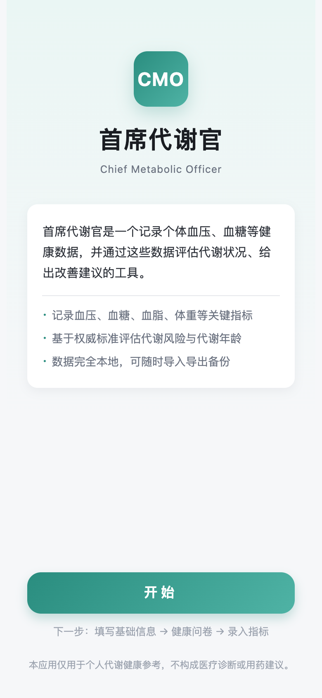
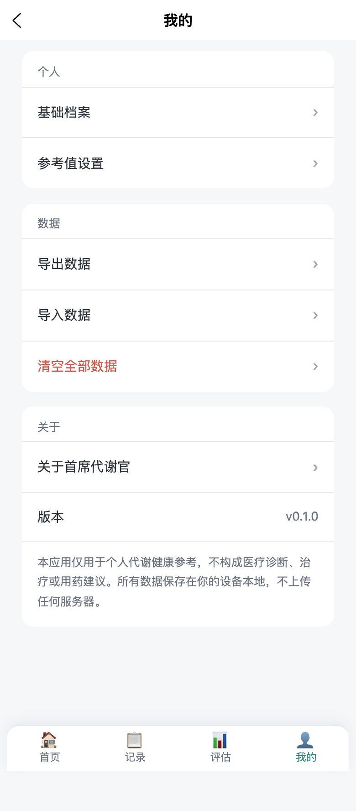

# 首席代谢官 · Chief Metabolic Officer

纯前端的个人代谢健康自评估应用。

**不需要后端，不需要数据库，不需要账号。**  
血压、血糖、血脂、尿酸、体重等数据只存在你自己的设备上，并可随时导出 / 导入 JSON 备份。

[English](#chief-metabolic-officer) · [在线 Demo](https://peterway202410.github.io/cmo-health/) · [备份格式](./docs/backup.md) · [更新记录](./CHANGELOG.md)

> 本应用仅供个人代谢健康参考，不构成医疗诊断、治疗或用药建议。

<p>
  
  
  
</p>

## 为什么开源

市面上多数健康 App 都要把数据上传到服务器。首席代谢官反其道而行：

| 传统健康 App | 首席代谢官 |
| --- | --- |
| 必须注册、登录 | 打开即用 |
| 数据在云端 | 数据只在本机（`uni.setStorage` / localStorage） |
| 换手机等于丢数据 | JSON 一键导出、导入，换设备可带走 |
| 依赖后端才能跑 | 静态页面即可运行 |

换电脑、换浏览器、换微信开发者工具，只要把备份 JSON 导进去，档案、问卷、指标和参考值都会回来。

## 能做什么

- **基础档案**：出生日期、性别、身高、既往史、活动水平
- **生活方式问卷**：睡眠、饮食、运动、饮酒吸烟、压力
- **指标记录**：体重/腰围、血压、血糖、血脂、尿酸（保留历史，不覆盖）
- **综合评估**：代谢评分、代谢年龄、代谢综合征、风险来源、行动建议
- **分项解读**：体重、血压、血糖、血脂、尿酸各自的趋势与说明
- **参考值可调**：阈值存在本地，可按个人情况改
- **备份**：导出 JSON / 导入（合并去重 或 完全覆盖）/ 一键清空

## 技术栈

- uni-app 3 + Vue 3 + TypeScript + Pinia
- 评估算法全部在前端 `src/domain/`，纯函数，无网络请求
- 存储封装在 `src/infra/storage/`
- 导入导出在 `src/infra/backup/`

可编译为 **H5**、**微信小程序**、**App**。

## 快速开始

需要 Node.js 18+。

```bash
npm install

# H5 开发（浏览器打开终端给出的本地地址）
npm run dev:h5

# 微信小程序
npm run dev:mp-weixin

# 生产构建
npm run build:h5
npm run build:mp-weixin
```

H5 开发入口是 Vite 开发服务器，**不能**直接双击根目录 `index.html`。  
打包产物在 `dist/build/h5/`，用任意静态服务器打开即可，例如：

```bash
npm run build:h5
npx --yes serve dist/build/h5
```

首次使用会进入欢迎页，填写基础档案后进入首页。

## 数据存在哪

全部走 uni-app 同步存储，键名以 `cmo:` 开头：

- `cmo:profile` 基础档案
- `cmo:questionnaire` 最新问卷
- `cmo:metrics:*` 体重 / 血压 / 血糖 / 血脂 / 尿酸
- `cmo:thresholds` 自定义参考值

H5 对应浏览器 localStorage；小程序对应微信本地缓存。  
应用本身不发起任何上传健康数据的网络请求。

备份文件是一份带 `schemaVersion` 的 JSON，可在「我的 → 导出数据 / 导入数据」里操作。字段说明见 [docs/backup.md](./docs/backup.md)。

## 项目结构

```
src/
  pages/          页面：欢迎、首页、记录、评估、我的、档案
  domain/         评估与建议算法（与 UI 解耦）
  infra/storage/  本地存储
  infra/backup/   JSON 导入导出
  stores/         Pinia
```

更细的产品说明见 `需求说明.txt`，算法说明见 `评估算法文档.md`。

## 免责声明

评估规则参考常见公共卫生标准（如中国成人超重肥胖、代谢综合征组分等），用于自我记录与参考，**不能替代医生面诊、化验解读或用药指导**。

## 在线 Demo

H5 静态页（无后端，数据只存在你的浏览器里）：

https://peterway202410.github.io/cmo-health/

## 开发与测试

```bash
npm test
```

评估算法和备份导入导出有单元测试，见 `tests/`。提交 PR 时 GitHub Actions 会再跑一遍。

参与方式见 [CONTRIBUTING.md](./CONTRIBUTING.md)。安全问题请按 [SECURITY.md](./SECURITY.md) 私下报告，不要公开提 Issue。

---

## Chief Metabolic Officer

A local-first metabolic health tracker. **No backend, no database, no account.** Blood pressure, glucose, lipids, uric acid and weight stay on the device. You can export and import a JSON backup at any time.

Live demo (static GitHub Pages, data stays in *your* browser): https://peterway202410.github.io/cmo-health/

This is a personal reference tool, not medical advice.

### Stack

uni-app 3 + Vue 3 + TypeScript + Pinia. Scoring lives in `src/domain/` as pure functions. Storage is `src/infra/storage/`. Backup is `src/infra/backup/`.

```bash
npm install
npm run dev:h5
npm test
```

License: [GNU GPL v3](./LICENSE).

---

## 开源协议

[GNU General Public License v3.0](./LICENSE) © 常来常往工作室

你可以自由使用、研究、修改和再分发本软件。若对外发布修改版本，须同样以 GPL v3 开源，并保留版权声明。

欢迎 Issue 和 Pull Request。
